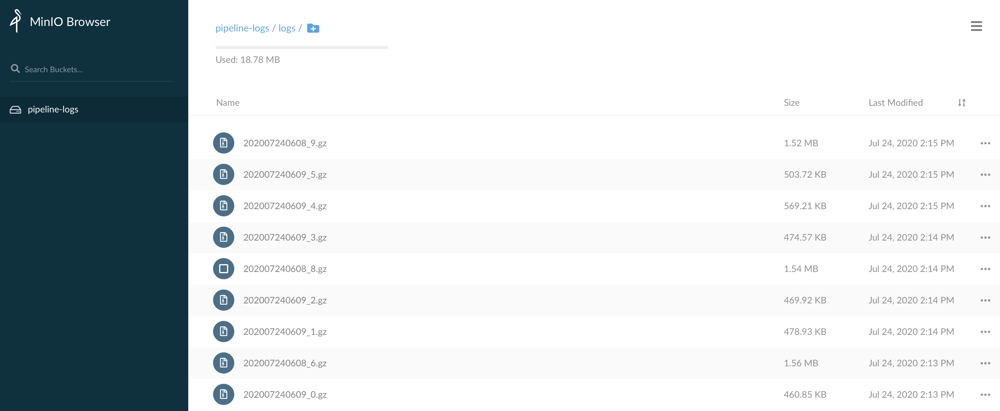

pipeline-logs-s3
===

Collect Tekton pipeline logs to AWS S3.

## Usage
1. Change `aws_key_id`, `aws_sec_key`, etc... variables in fluent.conf

2. Build fluted docker image, change Makefile to use your docker hub id, and run:
    > **Notes**: the size of the image is about **46** MB

    ```
    make all
    ```

3. Deploy DaemonSet to collect pods logs to S3:

    ```
    make deploy
    ```

## Result
The container logs will be archived to S3 as below picture



## Todo Tasks
- [ ] Filter to Select the Containers belongs to Special Tekton Pipeline Run
- [ ] Store the logs in S3 with the dir of: NameSpace/Pod_Name/Container_Name
- [ ] Integrate to KFP-Tekton by `Finally`

### Derived from:

+ [Fluentd base image](https://github.com/fluent/fluentd-docker-image)
+ [Fluentd S3 plugin](https://docs.fluentd.org/output/s3)
