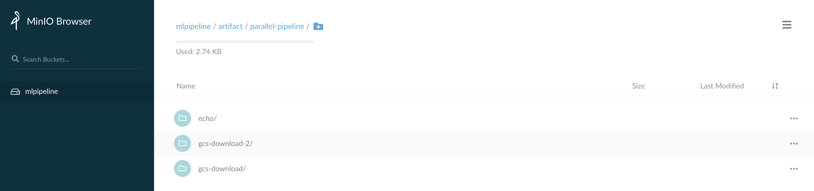
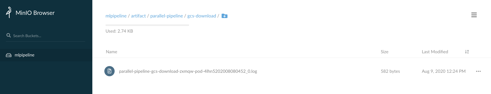

pipeline-logs-s3
===

Collect Tekton pipeline logs to S3, via Fluentd in a DaemonSet.

## How to use it

### 1. Create secret for your S3 ACCESS_KEY_ID and SECRET_ACCESS_KEY (admin123):
```
ACCESS_KEY_ID=admin123
SECRET_ACCESS_KEY=admin123
kubectl -n kube-system create secret pipeline-logs-s3-secret --from-literal "accesskey=$ACCESS_KEY_ID" --from-literal "secretkey=$SECRET_ACCESS_KEY"
```
### 2. Create configMap:

```
kubectl apply -f - <<EOF
apiVersion: v1
kind: ConfigMap
metadata:
  name: pipeline-logs-s3-config
  namespace: kube-system
data:
  S3_ENDPOINT: http://9.21.53.162:31846/
  FORCE_PATH_STYLE: true
  S3_BUCKET: mlpipeline
  S3_REGION: test_region
EOF
```
> **Notes:**
>
> **S3_ENDPOINT**: Variabel of s3_endpoint, if you are using minio. e.g. http://9.21.53.162:31846
>
> **FORCE_PATH_STYLE**: This prevents AWS SDK from breaking endpoint URL, set true if you are using minio
>
> **S3_BUCKET**: Variabel of s3_bucket, e.g. mlpipeline
>
> **S3_REGION**: Variable of s3_region, e.g. us-east-1 or test_region

### 3. Collect the pipeline logs to S3
```
kubectl apply -f https://raw.githubusercontent.com/fenglixa/pipeline-logs-s3/master/pipeline-logs-fluentd-s3.yaml
```


## [Optional] Build image
1. Clone the repo, refer to [fenglixa/pipeline-logs-s3](https://github.com/fenglixa/pipeline-logs-s3):
```
git clone https://github.com/fenglixa/pipeline-logs-s3.git
cd pipeline-logs-s3
```
2. Change the image name in "Makefile", and build your docker image via `make build`

## Demo Result
The container logs will be archived to S3 as below picture



